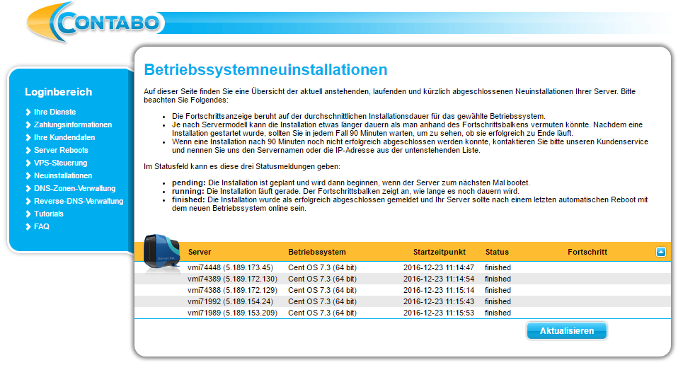

# Setup a Kubernetes cluster

## Setup the servers for the cluster
I am using 5 small servers from [contabo](https://contabo.com/?show=configurator&vserver_id=217).  
For the setup with [`kubeadm`](http://kubernetes.io/docs/getting-started-guides/kubeadm/) 
the OS has to be Ubuntu 16.04 or CentOS 7.x. In my case I am going with **Cent OS 7.3 (64 bit)**.  

  

> The setup is working in the [AWS Cloud](https://aws.amazon.com) with 
> **[Ubuntu 16.04 LTS - Xenial (HVM)](https://aws.amazon.com/marketplace/pp/B01JBL2M0O)** 
> and **[CentOS 7 (x86_64) - with Updates HVM](https://aws.amazon.com/marketplace/pp/B00O7WM7QW)** 
> as well.

That the Kubernetes setup can access the servers we have to install our ssh keys to the servers.
If you don't have a ssh key you can create one with the following command:
```bash
ssh-keygen -t rsa -b 4096
```
Now we have to install our public key on every server:
```bash
ssh-copy-id root@5.189.153.209
```
We can test the setup if we try to ssh into the server:
```bash
ssh root@5.189.153.209
```
If the connection is working our initial setup of the server is done.

## Setup the cluster with Ansible
The setup with `kubeadm` is really simple, but still includes some manual steps that can be automated.
Therefore a good friend of mine wrote a Ansible playbook that can be checked out from [here](https://github.com/pstauffer/kubernetes-setup)
```bash
git clone https://github.com/pstauffer/kubernetes-setup
```
Create an inventory file with the following content:
```bash
[master]
5.189.173.45

[minions]
5.189.172.130
5.189.172.129
5.189.154.24
5.189.153.209

[cluster:children]
master
minions

[cluster:vars]
# kubernetes part
kubemaster_token = abcdef.abcdefabcdefabcd

# ansible part
ansible_ssh_private_key_file = /home/battleapp/.ssh/id_rsa
ansible_user = root

# python part
install_python_centos = true
install_python_ubuntu = false
```
Start the setup playbook with this inventory:
```bash
ansible-playbook -i inventories/sample playbooks/setup.yml
```
Install `kubectl` like described [on this site](http://kubernetes.io/docs/getting-started-guides/kubeadm/) on your host machine. 
Test the installation:
```bash
kubectl -h
```
Download the `admin.conf` from your master:
```bash
scp root@5.189.173.45:/etc/kubernetes/admin.conf .
```
Create an alias for your cluster:  
Create the file `.alias` in your home directory with the following content:
```bash
alias kc='kubectl --kubeconfig /home/[HOST USER]/Desktop/admin.conf'
```
Extend the `.bashrc` of the home directory:
```bash
. ~/.alias
```
Execute `alias` in the current bash:
```bash
. .alias
```
Test the cluster:
```bash
kc get no
NAME                    STATUS         AGE
vmi71989.contabo.host   Ready          21m
vmi71992.contabo.host   Ready          22m
vmi74388.contabo.host   Ready          22m
vmi74389.contabo.host   Ready          22m
vmi74448.contabo.host   Ready,master   24m
```
