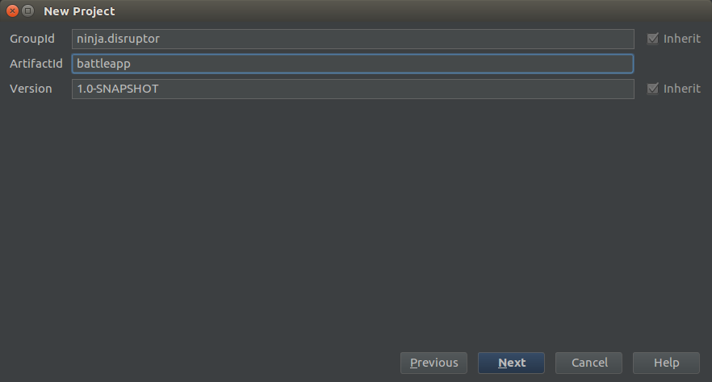
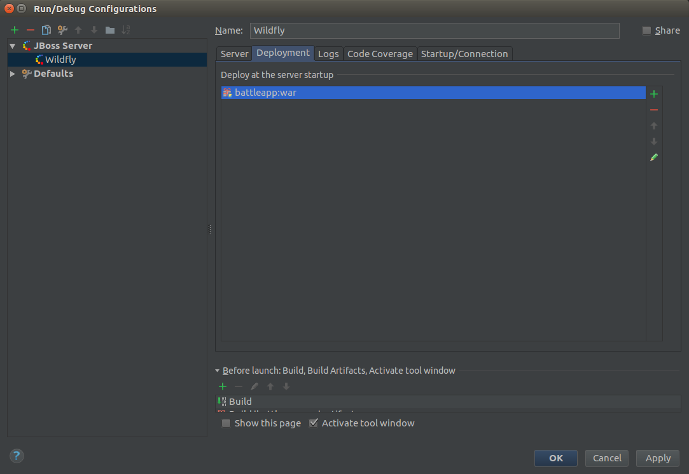

# Creating our first microservice
Our first microservice is a REST service written in Java. I'm using JavaEE and Wildfly
as application server. JavaEE is the perfect combination with Docker.  
Wildfly can be downloaded from [here](http://wildfly.org/downloads/).  
As IDE I'm using IntelliJ.
> IntelliJ and Maven is already installed during the [host setup](../01_Setup/Host_setup.md).

## Setup a new maven project
I'm using a minimalistic maven setup:  
`com.airhacks:javaee7-essentials-archetype:1.3`  

To create a project in IntelliJ with this Archetype you have to open IntelliJ and choose 
`File -> New -> Project...`  
And make the following settings:


If you creating a project with this Archetype for the first time you have to use `Add Archetype...`
and insert the information from the Archetype.

Now click `Next` and insert the project settings:


Click `Next` `Next` `Finish`

Now you can implement the REST service. I've made a simple service that can be cloned from
[here](https://github.com/robertBrem/battleapp).

## Using Lombok
I use Lombok in my example service. To use Lombok you have to add the dependency to the 
`pom.xml` as well as to install the Lombok plugin in IntelliJ. You can install the plugin
over `File -> Settings...` `Plugins` `Browse repositories...` and search for *Lombok*.


Click `Install` `Restart`.

## Wildfly in IntelliJ
You can setup Wildfly in IntelliJ over the `Edit Configuration...` menu.


Click on the `+`


In the `Server` tab make the following settings:


Change to the `Deployment` tab and add the artifact:


## Test the service
To test the service you simply have to push the play button:


And call the following url: `http://localhost:8080/battleapp/resources/users`.
The output should be something like that:
```bash
[{"name":"dan"},{"name":"robert"},{"name":"kevin"}]
```
