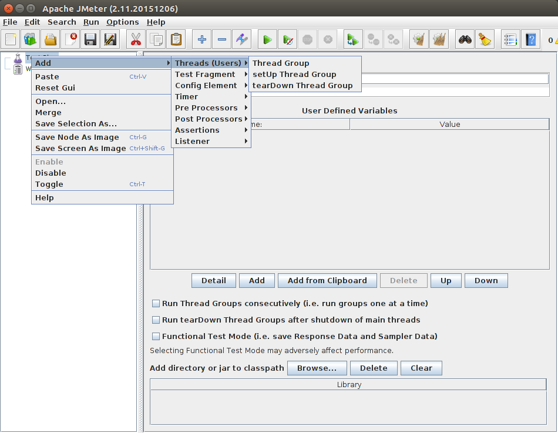
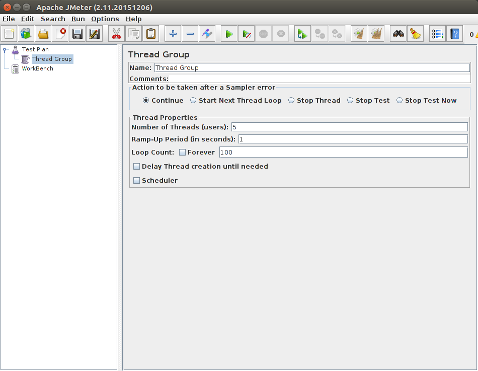
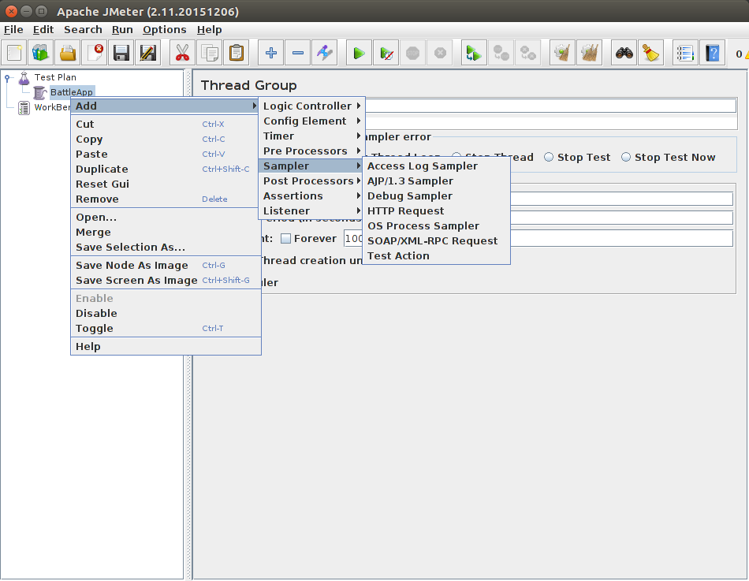
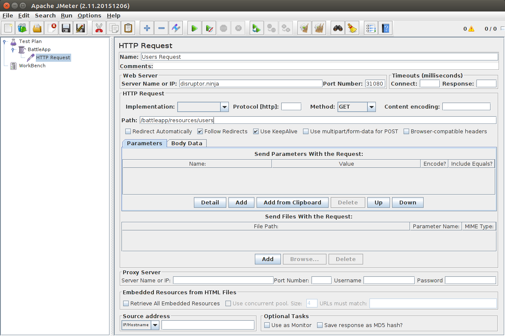
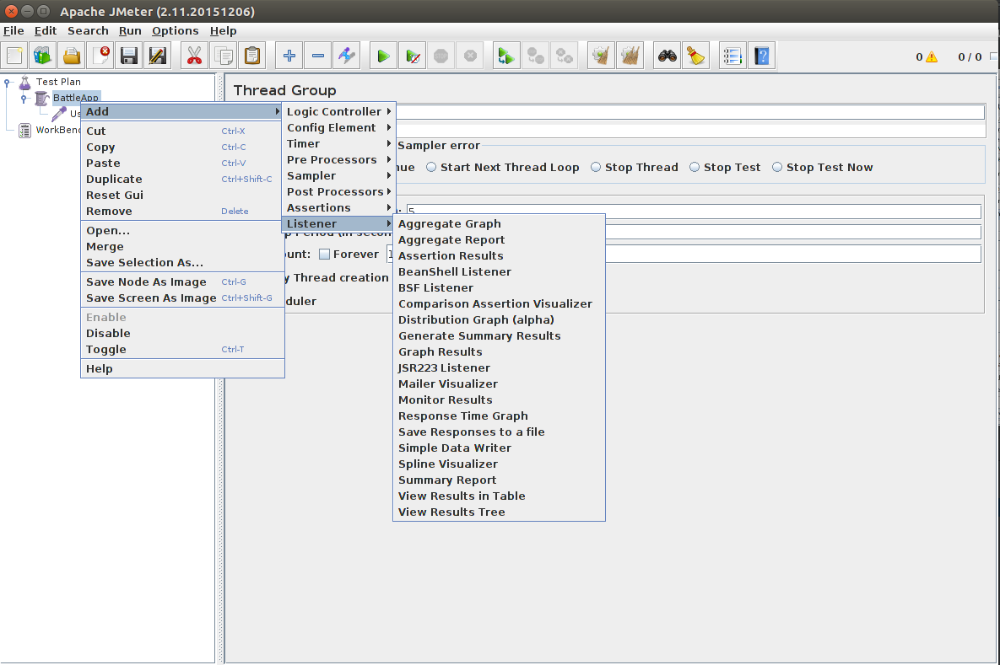
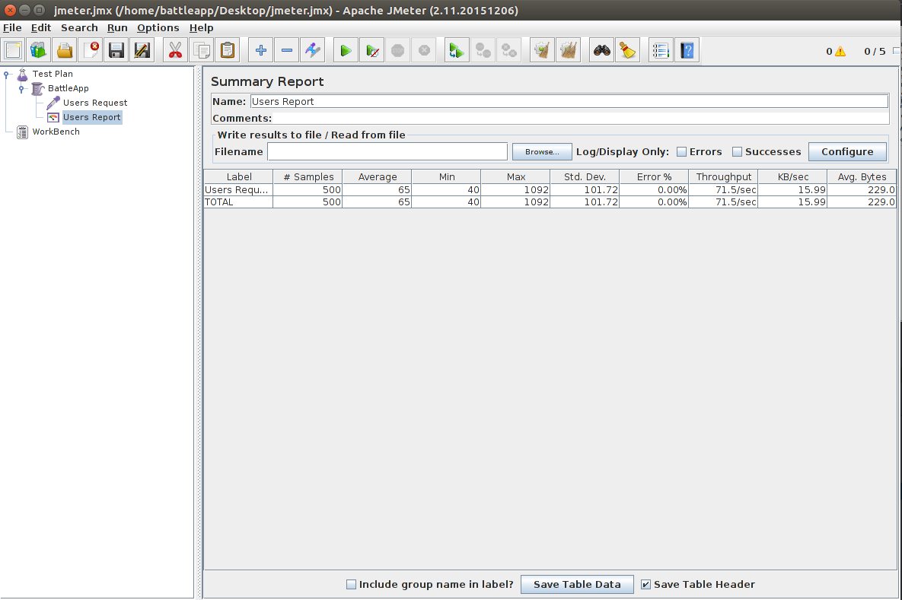

# Lasttest
We're going to use JMeter for our last tests.

## Install JMeter
Install JMeter on your local machine.
```
sudo apt-get install jmeter -y
```

## Create a JMeter test in JMeter
Start JMeter.
```
jmeter
```
Right click on `Test Plan` `Add -> Threads (Users) -> Thread Group`.  


Make the following settings:  
*Number of Threads (users):* **5**  
*Ramp-Up Period (in seconds):* **1**  
*Loop Count:* **100**  



Right click on `Thread Group` `Add -> Sampler -> HTTP Request`.  


Make the following settings:  
*Server Name or IP:* **disruptor.ninja**  
*Port Number:* **31080**  
*Path:* **/battleapp/resources/users**  



Right click on `Thread Group` `Add -> Listener -> Summary Report`  


Click on .  
Save the run in `test.jmx`.



## Create last test project
Create a last test similar to [this one](https://github.com/robertBrem/BattleApp-LT).

Move the `test.jmx` file in this folder `/src/test/jmeter/test.jmx`.  

Parametrize the `test.jmx` file. The syntax is:
```
${__property(host)}
```

Add the following Maven settings:
```
<build>
    <finalName>battleapp.lt</finalName>
    <plugins>
        <plugin>
            <groupId>com.lazerycode.jmeter</groupId>
            <artifactId>jmeter-maven-plugin</artifactId>
            <version>2.0.3</version>
            <configuration>
                <propertiesUser>
                    <host>${performancetest.webservice.host}</host>
                    <port>${performancetest.webservice.port}</port>
                    <iterations>${performancetest.webservice.iterations}</iterations>
                    <threads>${performancetest.webservice.threads}</threads>
                    <url>${performancetest.webservice.url}</url>
                </propertiesUser>
            </configuration>
            <executions>
                <execution>
                    <id>jmeter-tests</id>
                    <goals>
                        <goal>jmeter</goal>
                    </goals>
                </execution>
            </executions>
        </plugin>
        <plugin>
            <groupId>com.lazerycode.jmeter</groupId>
            <artifactId>jmeter-analysis-maven-plugin</artifactId>
            <version>1.0.6</version>
            <executions>
                <execution>
                    <goals>
                        <goal>analyze</goal>
                    </goals>
                    <phase>post-integration-test</phase>
                </execution>
            </executions>
            <configuration>
                <source>${project.build.directory}/jmeter/results/*</source>
                <targetDirectory>${project.build.directory}/reports</targetDirectory>
            </configuration>
        </plugin>
    </plugins>
</build>
<properties>
    <maven.compiler.source>1.8</maven.compiler.source>
    <maven.compiler.target>1.8</maven.compiler.target>
    <failOnMissingWebXml>false</failOnMissingWebXml>
    <performancetest.webservice.host>ninja.disruptor</performancetest.webservice.host>
    <performancetest.webservice.port>31080</performancetest.webservice.port>
    <performancetest.webservice.iterations>31080</performancetest.webservice.iterations>
    <performancetest.webservice.threads>31080</performancetest.webservice.threads>
    <performancetest.webservice.url>/battleapp/resources/health</performancetest.webservice.url>
</properties>
```

Start Maven with the parameters set:
```
mvn clean verify -Dperformancetest.webservice.host=localhost -Dperformancetest.webservice.port=8080 -Dperformancetest.webservice.threads=2 -Dperformancetest.webservice.iterations=50 -Dperformancetest.webservice.url=/battleapp/resources/users
```

## Create the Jenkins pipeline step
Include the test in the Jenkins pipeline:
```
  stage "last test"
  node {
    git url: "https://github.com/robertBrem/BattleApp-LT"
    def mvnHome = tool 'M3'
    sh "${mvnHome}/bin/mvn clean verify -Dperformancetest.webservice.host=disruptor.ninja -Dperformancetest.webservice.port=31080 -Dperformancetest.webservice.threads=5 -Dperformancetest.webservice.iterations=500 -Dperformancetest.webservice.url=/battleapp/resources/users"
    archiveArtifacts artifacts: 'target/reports/*.*', fingerprint: true
  }
```

Then `Build Now`.